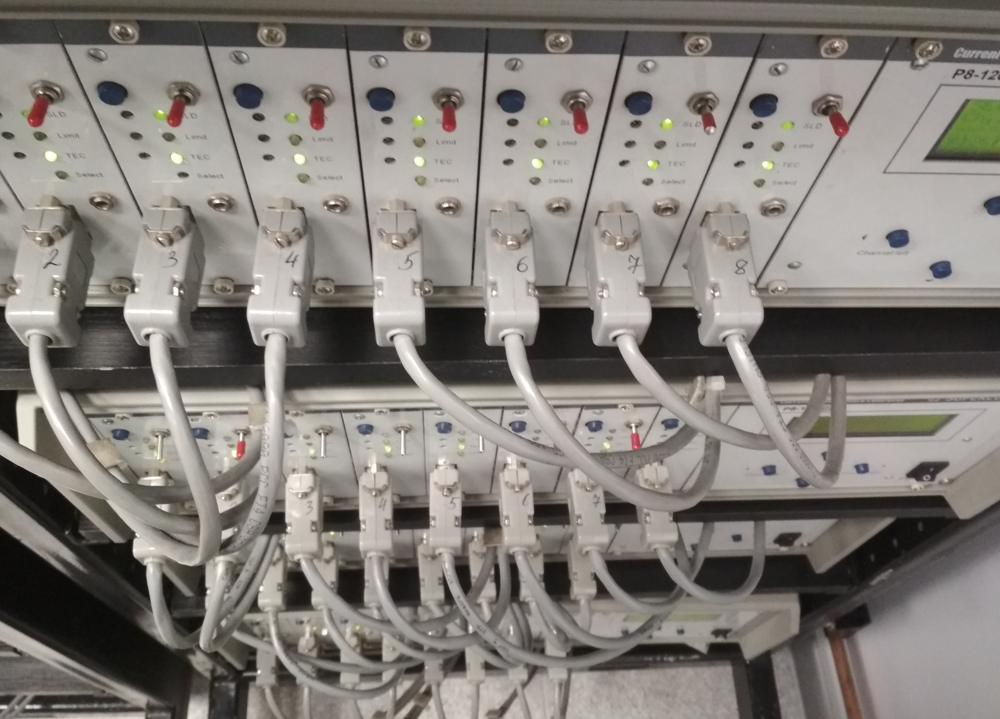

# DAQ (Data acquisition)

    
  </a>

The DAQ application is designed to automate the process of polling an array of specific devices through virtual com ports and generating logs of the appropriate format.
## Overview
Note devices as well as implemented and used software developed more than 20 years ago.
Therefore, strict requirements are imposed on DAQ for backward compatibility in the format of settings and the format of output logs.

The survey is multithreaded in synchronous mode with a fixed delay.
A device is connected to each port. The devices are equipped in shelves with 4 devices in each.

For example, the designation 'B01-4' means - shelve is 'B01', the device number is 4.

Each device has 8 channels for polling and 2 tabs with SET and REAL parameters.

For example, the designation 'B01-4-8' means - shelve is 'B01', the device number is 4 and channel number is 8.

Switching between channels and SET and REAL tabs is rather slow (about 300-400 milliseconds) thus the default delay value is set to 500 milliseconds.

Also, each device can operate at 2 set temperatures (usually room and high).

There is also a limited ability to switch temperatures programmatically.

## Translations
- [ ] [Русский (Russian)](./topics/ru/readme.md)
